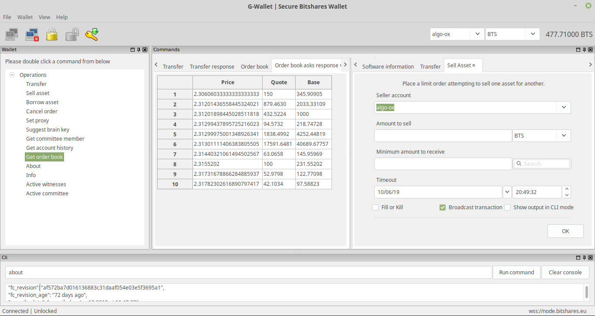

# G-Wallet - Desktop Bitshares Wallet

G-Wallet is a Bitshares desktop(Linux, Windows, MAC) wallet program written in C++ using [wxWidgets](https://www.wxwidgets.org/).

This document is in constant change, it haves questions and annotations, it is just reference and not definitive.

G-Wallet code is EXPERIMENTAL.

Current branch: https://github.com/oxarbitrage/bitshares-core/tree/gwallet

Compare: https://github.com/bitshares/bitshares-core/compare/develop...oxarbitrage:gwallet?expand=1

Commit history: Current commit history is messy, it is not recommended to follow.

- [Background](#Background)
- [Motivation](#Motivation)
- [Why wxWidgets?](#Why-wxWidgets)
- [Architecture](#Architecture)
- [Visual Design](#Visual-Design)
  - [Icons](#Icons)
  - [GUI Builder](#GUI-Builder)
- [Current features](#Current-features)
  - [Cli mode](#Cli-mode)
  - [Home mode](#Home-mode)
  - [Send/Receive mode](#Send-and-Receive-mode)
  - [History mode](#History-mode)
  - [Wallet mode](#Wallet-mode)
- [Install](#Install)
- [First time users](#First-time-users)
- [Internationalization](#Internationalization)
  - [Translate my wallet](#Translate-my-wallet)
  - [Add new translations](#Add-new-translations)
- [Known issues](#Known-issues)
  
  
## Background
  
The Bitshares blockchain enjoy a rich collection of wallet software that allow users to interact with the chain in different ways or by different channels.

The [reference wallet](https://github.com/bitshares/bitshares-ui) focus on the web and it is the favourite for businesses building on top of Bitshares(Decentralized EXchanges); mobile wallets are available just as [bitshares-mobile-app](https://github.com/bitshares/bitshares-mobile-app); command line tools exists like [upticks](https://github.com/bitshares/uptick) or the [cli_wallet](https://github.com/bitshares/bitshares-core/tree/master/programs/cli_wallet) which is part of the [bitshares-core](https://github.com/bitshares/bitshares-core), etc.

In the desktop side we have [citadel](https://github.com/jhtitor/citadel) wallet  witch is a python + qt wallet, it is the most similar to G-Wallet but they are built for different audiences.

The main purpose of G-Wallet is to be a graphical interface for the cli_wallet, supporting the same commands.
  
## Motivation

From the core side there is only 1 official program to interact with the blockchain, it is the `cli_wallet` and it is a common program to all graphene blockchains.

The bitshares-core haves a programs folder but there is actually only 2 programs for the end users(`witness_node` and `cli_wallet`), rest are utilities. 

This project aims to add a third program for the end users into the core programs folder.

In addition to that, other motivations are:

- Create a GUI in C++ that can be used as an entry point to bitshares-core for new developers.
- Gain more adoption by having a new entry point for end users.
- Contribute to wallet library development as program uses that API.
- New functionality can be added with relative ease into the software after commands are added to the cli_wallet. 
- All graphene chains will be able to use it and make changes as they need featuring their own stuff while having the common functionality.
- Local wallets are more secure than online hosted ones.
- Core team can review and validate G-Wallet code with the strict standards of quality the team already implements in the rest of the project.

## Why wxWidgets

3 main reasons:

- wxWidgets is only 1 dependency.
- Plays better with our codebase than other frameworks.
- Everything needed to develop with wxwidgets is in the [documentation](https://docs.wxwidgets.org/3.0/), the [wiki](https://wiki.wxwidgets.org/Documentation) and the [forum](https://forums.wxwidgets.org/).

## Architecture

G-Wallet is currently not a complete program. It is the building blocks for one, with scaling in mind. The final goal is to support all the cli_wallet functionality and more.

For this, we separated the development in different classes, files and directories. All the classes can communicate with the others when they need by pointers to instances.

The `GWallet` class is the main class and it is in charge of managing the program menu, toolbar, statusbar and other elements outside the client area. Everything inside the client area haves its own class, rest is managed by `GWallet` class.

Smell: GWallet is a superclass with too many responsibilities, should be reduced to smaller pieces respecting the most we can the SRP.

The G-Wallet haves currently 5 modes that are handled by 5 different classes:

- Home mode - Display some blockchain and account info - `Home` class.
- Command line mode - Act as the cli_wallet where user can send commands and receive response - `Cli` class.
- Send/Receive mode - Quick forms to send, receive and generate BSIP60 compatible urls - `SendReceive` class.
- History mode - Show past user operations(limited to only last 25 atm) - `History` class.
- Wallet mode - List and execute all wallet commands supported `Wallet` class.

The 5 modes can be accessed from the toolbar only after the wallet is at least connected.

The connection stuff is done in a `Bitshares` class.

All operations in wallet mode are dialogs and have their own classes, we have the `ImportKeyDialog` class for the import key wallet operation, we have the `TransferDialog` class for the transfer operation form and so on.

Currently, we only have 1 wizard to create a new wallet. This wizard is located in the `wizards` folder, each page is a class(`Welcome1`, `Welcome2`, `Welcome3` and `Welcome4`) but they are defined and declared in just 2 files(`welcome.cpp` and `welcome.hpp`).

G-Wallet makes use of `wxConfig` to store some data that will help the user when starting the program next time.

The current state of the application is saved in a `State` struct where boolean variables flags in the form of `is_xxx` are turned on and off accordingly.

## Visual Design

Default application size is 1200x900, app can be maximized and reduced down to 600x450 where things start to look ugly.

Main window application is a menubar, a toolbar, a single panel where mode data will be inserted in and a statusbar at the bottom. Additional windows are dialogs or wizards.

### Icons

Icons are currently from https://sourceforge.net/projects/openiconlibrary/ in png format. 
wxWidgets support xpm, icons, which are cpp code files. They can be replaced by this if png is a problem.

Icons should be replaced by custom made iconography from a bitshares designer.

### GUI Builder

Luckily there are tools to build the forms in a visual way, auto generating the cpp code of visually designed rich windows.

A few of them are:

- http://www.anthemion.co.uk/dialogblocks/
- https://github.com/wxFormBuilder/wxFormBuilder

More can be found at: https://wiki.wxwidgets.org/Tools#IDEs

The current version of G-Wallet was developed using the dialogblocks, however a move into wxFormBuilder is a strong possibility as it is a more active project, open source, free, etc.

## Current features

### Command line mode

Allow to execute commands just as with the cli_wallet. Command line wallet functionality is embedded by the G-Wallet in the console mode.

### Send and Receive mode

Allows to create a quick transfer with no memo where the `from` is the account currently selected. In order to get acess to this mode your wallet must be unlocked.

It also generate [BSIP60](https://github.com/bitshares/bsips/blob/master/bsip-0060.md) compliant urls to paste in other software.

To do: GWallet should also allow command line arguments, open the bitshares:// protocol uri and when transfer, open populated form.

QR codes: Urls should be encoded in QR code, libraries in C++ for this are available but it is not decided yet which one we will use. Probably something in the form of a submodule. Current QR images in the wallet are placeholders.

### History mode

Display the last 25 operations made by the selected account.

### Home mode

Show some stats, suggestions for better stuff is welcome.

### Wallet mode

List and execute wallet operations.

The buttons will open dialogs for each command, only `transfer`, `sell_asset`,`borrow_asset`,  `cancel_order` and `set_voting_proxy` commands are available ATM, more coming soon.

Transfer dialog:

Sell Asset dialog:

Borrow Asset dialog:

Cancel Order dialog:

Update Proxy dialog:

## Install

Ubuntu instructions assuming you already have all needed to install bitshares-core software.

Add wxWidgets to your system:

    $ sudo apt-get install libwxgtk3.0-dev

Get the code and compile as usual:

    git clone https://github.com/oxarbitrage/bitshares-core
    cd bitshares-core
    git checkout -t origin/gwallet
    git submodule update --init --recursive
    cmake -DCMAKE_BUILD_TYPE=RelWithDebInfo .
    make

Simply run the following to get started:

    ./programs/gwallet/gwallet
    
## First Time users

The G-Wallet cant currently create new accounts. A request to a faucet to create account is a desired feature that will probably be added but it is currently not available. 

To use the software you need a created account and private keys of it.

You can refer to [wiki](https://github.com/bitshares/bitshares-core/wiki/Import-account-to-cli-wallet) to export your private keys from the reference wallet to the cli wallet. The procedure to install your keys in the G-Wallet is similar to the cli wallet(actually same commands are used) but with graphical forms instead.

Start the G-Wallet by typing the following from the bitshares-core root:

`./programs/gwallet/gwallet`

Note: To help in the development it is recommended that you start the program in gdb node and get backtrace of crashes.

Click File→New and start the setup wizard.

The welcome wizard that will guide you to the setup process, remember to have account name and private key handy

## Internationalization

G-Wallet is currently available in English(default), Spanish and Chinese. 
 
### Translate my wallet

Go to File -> Change language and select one of the 3 options.

If you dont have the locale for the language selected you will see an error and the wallet will not be translated. 

To install a new locale with Ubuntu based distro do something as:

`locale -a` - List locales

`sudo locale-gen zh_TW` - Install locale

`sudo update-locale` - Update locales

If your locale is available the program need to be restarted for the changes to take effect and translations are visible.
Todo: Improve UX there.

 
### Add new translations

Catalogs are used to translate string from the program. For each language we have a folder with 2 files, for example for spanish we have:

 - programs/gwallet/i18n/es/gwallet.po
 - programs/gwallet/i18n/es/gwallet.mo
 
 `gwallet.po` is edited with [poedit](http://www.poedit.org/), and the `gwallet.mo` is embedded to the binary.
 
 Adding a new language is as simple as adding a new folder with the language and the 2 files on it.
 The 2 files for any language can be generated by poedit by extracting the strings to be translated directly from source code.
 
 The only thing left is to add the new idiom to the Select language dialog in `GWallet::OnChangeLanguage`

## Known issues and short term TODO

There are currently a bunch of errors and desired features, following are just some of them.

### Test cases

Test cases to the GUI are possible and will be added.

https://github.com/wxWidgets/wxWidgets/blob/master/docs/contributing/how-to-write-unit-tests.md

### Creating graphical objects in XRC files

If we have the same level of control then it will be a good idea to use XRC files and reduce amount of c++ code.

https://wiki.wxwidgets.org/Using_XML_Resources_with_XRC

DialogBlocks haves the option of generating this files.

### Cleanup, refactor, inconsistencies, smells and improvements

Code is still poor in some places. Need to spot everything and fix/refactor. This is already happening with the most obvious ones but there is a lot to do.

### Windows and MAC

G-Wallet was only tested in Linux at this time.

### Dependency should be optional

Having wxwidgets as a requirement should be optional when building bitshares-core, probably a cmake flag or check for installed wxwidgets to decide the compilation of gwallet.

### Connect and disconnect

There are problems with disconnection and connecting again. This can be an event of the user by clicking disconnect and then connect or can be triggered automatically by the program if for example a new endpoint is added.
Sometimes this action will be compled while in others the program will crash.

The work the core team is making here https://github.com/bitshares/bitshares-core/issues/1690 will probabaly fix this issue.

### GTK fatal error in dialog

There is an error message when opening the transfer dialog. It says fatal but everything seems to be working fine. No idea what it is causing it.

    (gwallet:8616): Gtk-CRITICAL **: 15:09:29.954: IA__gtk_widget_get_direction: assertion 'GTK_IS_WIDGET (widget)' failed

### BusyBox missing text

Sometimes the BusyBox messages like "Please wait, connecting …" are not shown:

